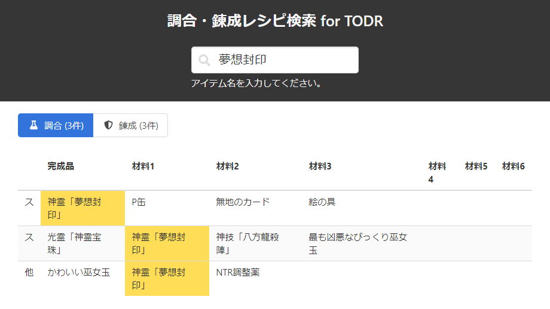

# 不思議の幻想郷TODR用 調合・錬成レシピ検索

AQUA STYLEのPS/NS/Steam用ゲーム、[不思議の幻想郷TODR](https://www.aquastyle.org/fushigentod_r/)の調合と錬成のレシピを、完成品や素材のアイテム名から検索できるツールです。
[こちら](https://fushigen-todr-recipe.herokuapp.com/)でデモ稼働中です。

## 使い方

タイトル下の検索欄にレシピを検索したいアイテム名（一部でもOK）を入力してEnterを押すと、該当するレシピの一覧が表示されます。

調合と錬成は別タブになっていて、どちらか一方しか同時には表示されません。それぞれボタンを押すと表示が切り替わります。

検索アイテムにヒットしたセルはハイライトで表示されます。また、検索結果のアイテムのセルをクリックすると自動的にそのアイテム名で検索し、連続でレシピをたどることができます。

ピンチ脱出に必要なアイテムの調達や不要なアイテムの有効活用、装備錬成の計画などに是非お役立てください。

## 動作環境

以下のブラウザで動作確認しています。

- Google Chrome
- Mozilla Firefox
- Microsoft Edge (※IE11では動作しません)
- Mobile Chrome

## Changelog

### v1.0.1
- ヘルプ追加
- 誤字修正

### v1.0.0
- ツール公開

## 使用しているツール・フレームワーク

### フロントエンド
- bulma : https://bulma.io/
- fontawesome : https://fontawesome.com/

### バックエンド
- npm
- express : https://expressjs.com/
- csv-parse : https://csv.js.org/parse/
- sqlite3 : https://github.com/mapbox/node-sqlite3

## 謝辞

レシピのデータは[不思議の幻想郷TODRwiki](fusigentod.dojin.com/todr/index.php)から拝借しています。ありがとうございます。
